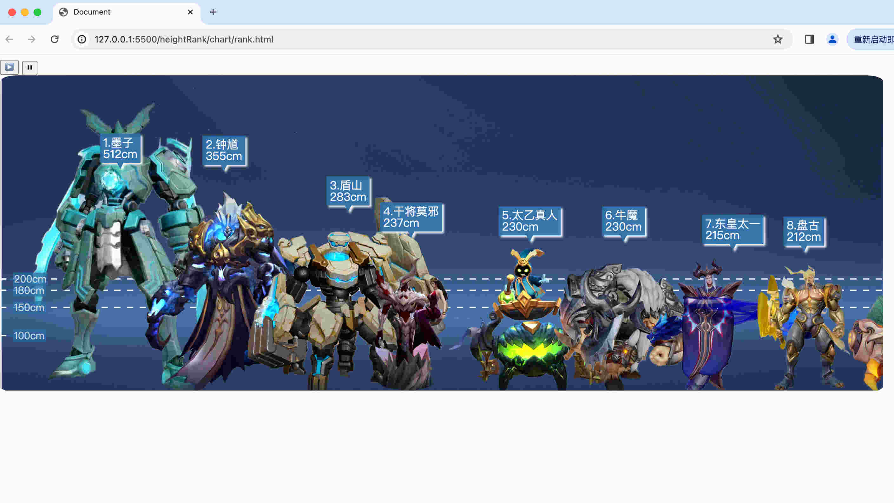

王者荣耀英雄身高排行


- heightRank/chart/heroHeight.json
英雄身高数据，一开始从网上数据转换得到，再手动补充需要的字段
heroImgHeight和sex为自己添加字段,heroImgHeight用于缩放图片，值为图片里人物的脚到头的像素大小(不包括头顶的装饰那些)
- craw目录 
下载原始数据的脚本
- rank.html
展示的网页

```json
   {
      "id": "107",
      "name": "赵云",
      "job": "战士/刺客",
      "height": 186,
      "heroImgHeight":868,
      "sex":"man"
   }
```


网页展示

- [-] 线条展示
- [ ] 手机，电脑兼容
- [ ] 可以缩放
- [ ] 黑色剪影模式
- [ ] 点击人物头像显示全屏
- [-] 图片增加原信息，净的高度，不包括其他物品的，比如小乔扇子

